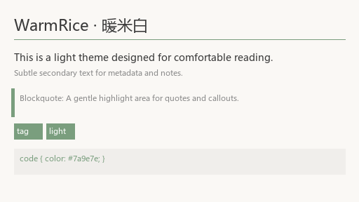

# WarmRice (暖米白)

A warm, natural light theme for Obsidian. Inspired by the Earth Online Survival Manual color palette.

## Features

- Soft warm background (`#faf8f5`) for comfortable long reading sessions
- Sage green accents (`#7a9e7e`) for interactive elements
- Terracotta highlights (`#d4a08a`) for emphasis
- Full Obsidian UI coverage
- Clean typography optimized for Chinese and English

## Preview

## Installation

### Community Themes (Recommended)
1. Open Obsidian Settings → Appearance → Themes
2. Click "Manage" → Search for "WarmRice"
3. Click "Install and use"

### Manual Installation
1. Download `manifest.json` and `theme.css` from the latest release
2. Create a folder `WarmRice` in your vault's `.obsidian/themes/`
3. Copy both files into the folder
4. In Obsidian, go to Settings → Appearance → Themes and select "WarmRice"

## License

MIT
